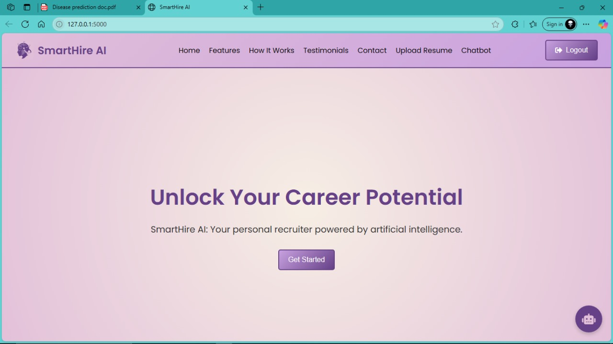
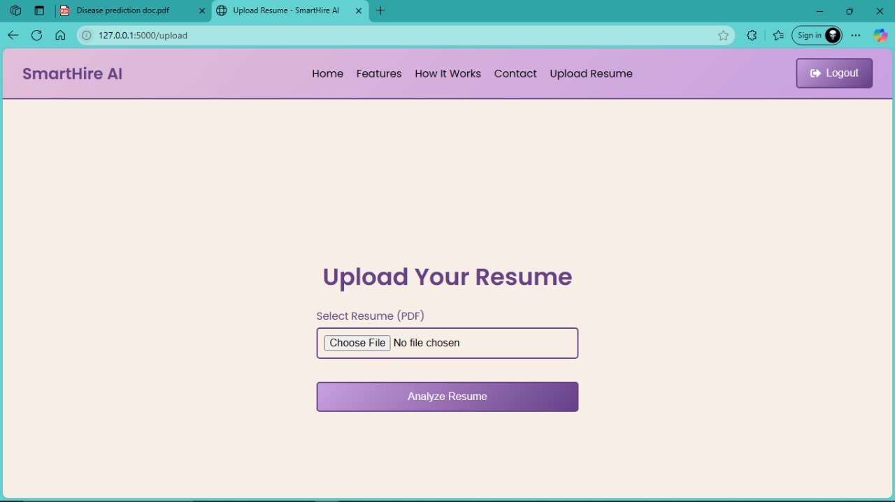
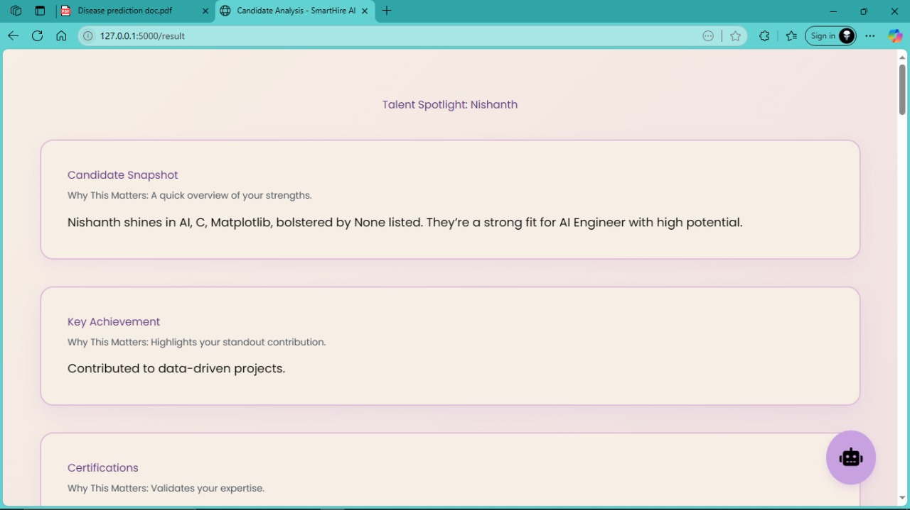
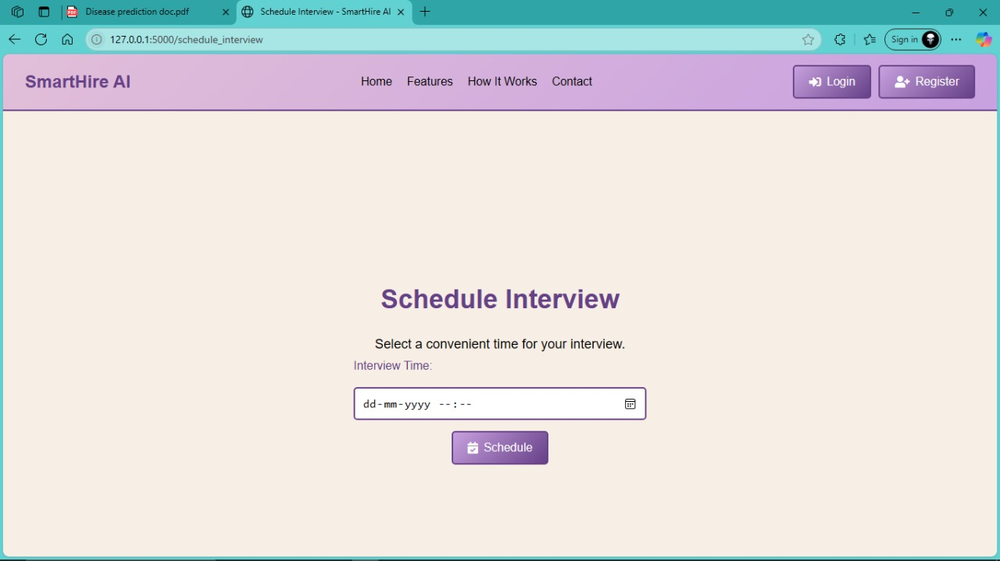
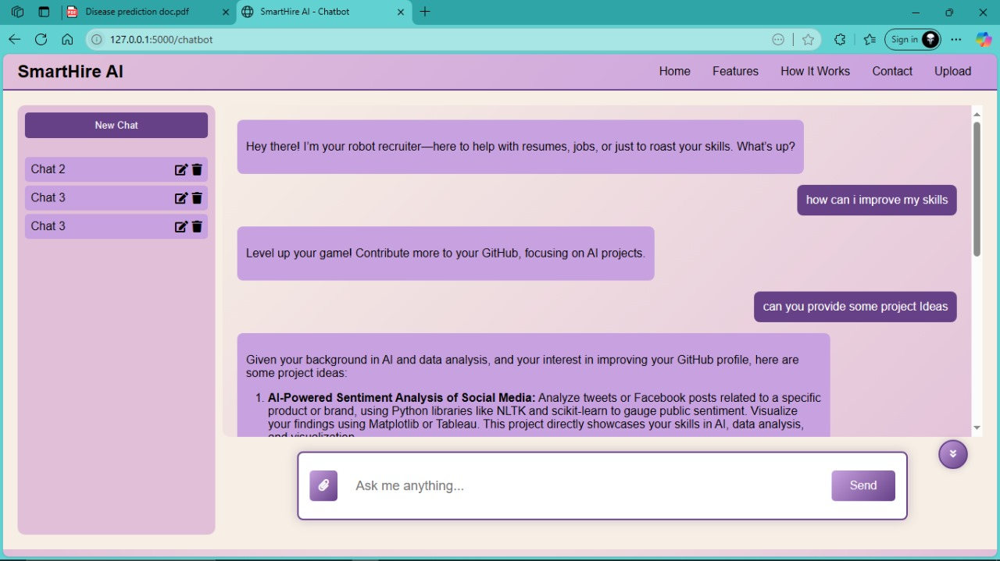
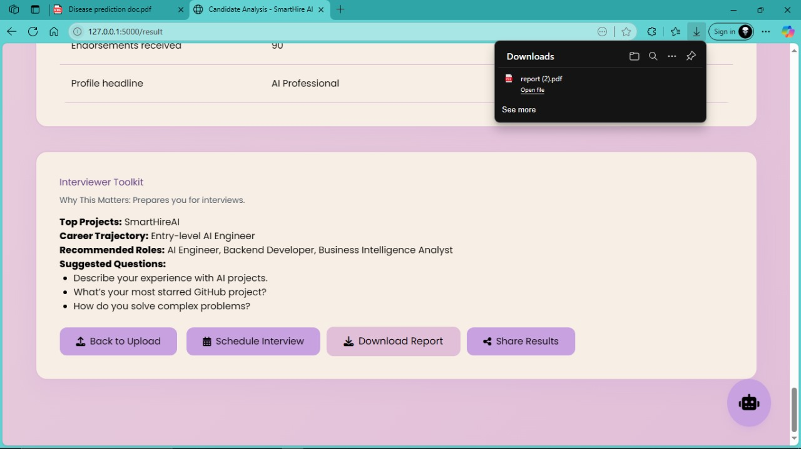

# SmartHire AI 🤖

SmartHire AI is a **personal AI-powered recruiter and career assistant** designed to help
candidates understand their professional profile, strengths, and career direction.

Instead of acting as a traditional ATS or resume parser, SmartHire AI behaves like a
**virtual recruiter** that guides users through resume analysis, skill evaluation,
career recommendations, interview preparation, and interactive AI support.

This project demonstrates how artificial intelligence can be used to create
**human-centric career guidance systems**.

---

## 🎯 Problem Statement

Job seekers often struggle with:
- Understanding how recruiters view their resume
- Identifying strengths and skill gaps
- Choosing suitable career paths
- Preparing for interviews
- Getting personalized guidance without expensive career coaching

Existing platforms are either static or focused only on recruiters.

**SmartHire AI addresses this gap by acting as a personal recruiter for the candidate.**

---

## 💡 What SmartHire AI Does

SmartHire AI simulates the behavior of a recruiter by:

- Analyzing resumes uploaded by candidates
- Highlighting key skills and achievements
- Providing AI-generated candidate insights
- Suggesting suitable roles and career paths
- Assisting with interview preparation
- Offering real-time chatbot-based career guidance
- Generating structured evaluation reports

The system focuses on **guidance, clarity, and career growth**, not rejection or filtering.

---

## 🧠 Core Features

### 📄 Resume Upload & Analysis
- Candidates upload their resume in PDF format
- The system extracts and processes relevant information
- AI evaluates skills, experience, and role alignment

### 📊 Candidate Insight Dashboard
- Highlights strengths and key achievements
- Displays career trajectory suggestions
- Recommends suitable job roles

### 🗓 Interview Scheduling
- Allows candidates to schedule interview slots
- Simulates recruiter interaction workflow

### 🤖 AI Career Chatbot
- Interactive chatbot that provides:
  - Skill improvement guidance
  - Project ideas
  - Career advice
- Designed to feel conversational and supportive

### 📑 Report Generation
- Generates downloadable candidate evaluation reports
- Useful for self-review and interview preparation

---

## 🛠 Tech Stack

**Backend & AI**
- Python
- Flask
- Machine Learning (custom logic & models)
- NumPy, Pandas
- Joblib

**Frontend**
- HTML
- CSS
- JavaScript

**Other Tools**
- Git & GitHub
- VS Code

---

## 📂 Project Structure

SmartHireAI/
├── app.py # Main Flask application
├── train_model.py # ML model training script
├── generate_training_data.py # Dataset generation logic
├── data/ # Training and processed data
├── templates/ # HTML templates
├── static/ # CSS, JS, assets
├── screenshots/ # Application screenshots
├── README.md # Project documentation
├── .gitignore # Ignored files and folders

## 📸 Application Screenshots

The screenshots below demonstrate the complete SmartHire AI workflow.

### 🏠 Home Page
Introduces SmartHire AI as a personal AI recruiter.

---

### 📄 Resume Upload
Candidates upload resumes for AI-based evaluation.

---

### 📊 Candidate Analysis Result
AI-generated insights highlighting skills, strengths, and career alignment.

---

### 🗓 Interview Scheduling
Simulated recruiter-style interview scheduling flow.

---

### 🤖 AI Chatbot Support
Interactive chatbot for career guidance, skill improvement, and project ideas.

---

### 📑 Report Generation
Downloadable AI-generated candidate evaluation report.

---

## 🚀 Use Case

SmartHire AI is useful for:
- Students and fresh graduates
- Entry-level professionals
- Career switchers
- Anyone seeking AI-assisted career guidance

---

## 🔮 Future Enhancements

- Advanced NLP-based resume understanding
- Real-time GitHub and portfolio analysis
- Personalized learning path recommendations
- Cloud deployment
- Recruiter analytics dashboard

---

## 👤 Author

**Nishanth**  
AI & Data Science Graduate   

SmartHire AI reflects my interest in building **practical, human-focused AI systems**
that solve real-world career and business problems.
